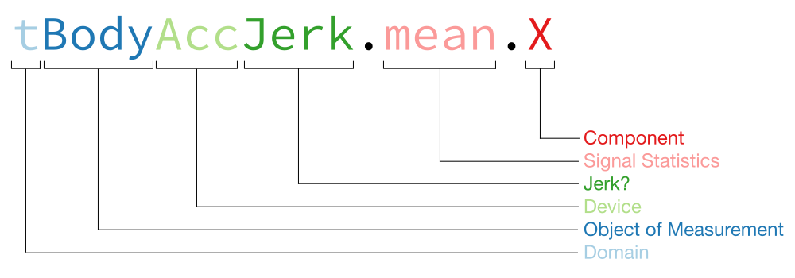

# CODE BOOK

This is the code book for the tidy versions of the [UCI HAR Dataset](http://archive.ics.uci.edu/ml/datasets/Human+Activity+Recognition+Using+Smartphones), generated by running [`run_analysis.R`](run_analysis.R).

## Tidy Dataset Files

The tidy dataset files, generated by running [`run_analysis.R`](run_analysis.R), are the following:

| File | Description |
| ---- | ----------- |
| `tidy_dataset_full.txt` | The full tidy dataset, containing the *mean* and the *standard deviation* for every measurement of both the *training* and the *test* raw datasets. |
| `tidy_dataset_summarized.txt` | Summarized dataset, with the average of each variable for each activity and each subject. |

## Reading the Files

Both of the tidy dataset files are text files, generated in R from a `data.frame` by calling `write.table()` using `row.names = FALSE`.

Therefore, reading them is easy, just use `read.table()` in R just like in the following code snippet:

```r
full_df <- read.table("tidy_dataset_full.txt",
                      header = TRUE)

summ_df <- read.table("tidy_dataset_summarized.txt",
                      header = TRUE)
```

If you have the `data.table` package installed, you can also use `fread()` to ingest the files, it's even easier:

```r
full_df <- fread("tidy_dataset_full.txt")

summ_df <- fread("tidy_dataset_summarized.txt")
```

## Dataset Structure

Both datasets (full and summarized) consist of the same structure: a table in *wide* format: that is, measured variables all each have a column dedicated to them and named after the variable.

### Rows

Each row in the tables represent the following:

| File | Row Description |
| ---- | --------------- |
| `tidy_dataset_full.txt` | Each row represents a single observation. |
| `tidy_dataset_summarized.txt` | Each row contains a summary of all observations for a given combination of **subject** and **activity**. This summary was constructed by taking the mean of all measured variables obtained in each of the observations. |

### Columns

The layout of the columns is as following, on both files:

| Index | Name | Computer Data Type | Statistical Data Type | Description |
| ----- | ---- | --------- | ------------- | ----------- |
| 1 | `subject` | integer | Categorical | A number that uniquely identifies the **subject** being observed, which is a human being performing a series of activities for which the measurements were taken. |
| 2 | `activity` | string | Categorical | A label describing and identifying the **activity** being performed by the subject during the observation. Can be one out of 6 possible values: `WALKING`, `WALKING_UPSTAIRS`, `WALKING_DOWNSTAIRS`, `SITTING`, `STANDING` and `LAYING`. |
| 3 to 68 | measured variable name: one of 66 possible names, see [Measured Variables](#measured-variables) for more details | real / float | Continuous | A real number, obtained as a measurement of a particular variable, taken during the observation (or the mean of such values, in case of the *summarized* dataset). |

### Measured Variables

***WARNING!*** Variable names in the tidy dataset are similar to the ones found in the raw dataset (in the file `features.txt`) but they **do not match 1:1**. See [Processing Steps Performed on Raw Dataset](#processing-steps-performed-on-raw-dataset) for more details.

The measured variables, or **features** (as they are called in the raw dataset's documentation), have a very particular naming scheme in the tidy dataset, illustrated by the following diagram:



Here's what each of the blocks of the diagram mean:

| Block | Possible Values | Description |
| ----- | --------------- | ----------- |
| Domain | `t` or `f` | `t` for the [Time Domain](http://en.wikipedia.org/wiki/Time_domain) and `f` for the [Frequency Domain](http://en.wikipedia.org/wiki/Frequency_domain) |
| Object of Measurement | `Body` or `Gravity` | Describes if the measurements refer to acceleration of the **subject**'s body or if they refer to the Earth's gravity. Gyroscope measurements always refer to the subject's body, therefore they're always labeled as `Body`. |
| Device | `Acc` or `Gyro` | `Acc` for the [accelerometer](http://en.wikipedia.org/wiki/Accelerometer), `Gyro` for the [gyroscope](http://en.wikipedia.org/wiki/Gyroscope). |
| Jerk? | `Jerk` or *nothing* | The variable name will have the word `Jerk` in it if the variable measures the [Jerk](http://en.wikipedia.org/wiki/Jerk_(physics)) instead of just the plain acceleration (for the accelerometer) or angular velocity (for the gyroscope). |
| Signal Statistics | `mean` or `std` | Indicates whether the variable represents the **mean** (`mean`) or the **standard deviation** (`std`) of the sampled signal. |
| Component | `X`, `Y`, `Z` or `mag` | Indicates the component of the signal: either the axial component for axes `X`, `Y` or `Z`, or the magnitude (`mag`) of that feature's vector. |

Here's a list of all 66 measured variables' names in the tidy dataset, broken down by their individual name components:

| Index | Variable | Domain | Object | Device | Jerk? | Statistics | Component |
| ----- | -------- | ------ | ------ | ------ | ----- | ---------- | --------- |
| 3 | `tBodyAcc.mean.X` | Time | Body | Accelerometer | no | mean | X axis |
| 4 | `tBodyAcc.mean.Y` | Time | Body | Accelerometer | no | mean | Y axis |
| 5 | `tBodyAcc.mean.Z` | Time | Body | Accelerometer | no | mean | Z axis |
| 6 | `tBodyAcc.std.X` | Time | Body | Accelerometer | no | standard deviation | X axis |
| 7 | `tBodyAcc.std.Y` | Time | Body | Accelerometer | no | standard deviation | Y axis |
| 8 | `tBodyAcc.std.Z` | Time | Body | Accelerometer | no | standard deviation | Z axis |
| 9 | `tGravityAcc.mean.X` | Time | Gravity | Accelerometer | no | mean | X axis |
| 10 | `tGravityAcc.mean.Y` | Time | Gravity | Accelerometer | no | mean | Y axis |
| 11 | `tGravityAcc.mean.Z` | Time | Gravity | Accelerometer | no | mean | Z axis |
| 12 | `tGravityAcc.std.X` | Time | Gravity | Accelerometer | no | standard deviation | X axis |
| 13 | `tGravityAcc.std.Y` | Time | Gravity | Accelerometer | no | standard deviation | Y axis |
| 14 | `tGravityAcc.std.Z` | Time | Gravity | Accelerometer | no | standard deviation | Z axis |
| 15 | `tBodyAccJerk.mean.X` | Time | Body | Accelerometer | yes | mean | X axis |
| 16 | `tBodyAccJerk.mean.Y` | Time | Body | Accelerometer | yes | mean | Y axis |
| 17 | `tBodyAccJerk.mean.Z` | Time | Body | Accelerometer | yes | mean | Z axis |
| 18 | `tBodyAccJerk.std.X` | Time | Body | Accelerometer | yes | standard deviation | X axis |
| 19 | `tBodyAccJerk.std.Y` | Time | Body | Accelerometer | yes | standard deviation | Y axis |
| 20 | `tBodyAccJerk.std.Z` | Time | Body | Accelerometer | yes | standard deviation | Z axis |
| 21 | `tBodyGyro.mean.X` | Time | Body | Gyroscope | no | mean | X axis |
| 22 | `tBodyGyro.mean.Y` | Time | Body | Gyroscope | no | mean | Y axis |
| 23 | `tBodyGyro.mean.Z` | Time | Body | Gyroscope | no | mean | Z axis |
| 24 | `tBodyGyro.std.X` | Time | Body | Gyroscope | no | standard deviation | X axis |
| 25 | `tBodyGyro.std.Y` | Time | Body | Gyroscope | no | standard deviation | Y axis |
| 26 | `tBodyGyro.std.Z` | Time | Body | Gyroscope | no | standard deviation | Z axis |
| 27 | `tBodyGyroJerk.mean.X` | Time | Body | Gyroscope | yes | mean | X axis |
| 28 | `tBodyGyroJerk.mean.Y` | Time | Body | Gyroscope | yes | mean | Y axis |
| 29 | `tBodyGyroJerk.mean.Z` | Time | Body | Gyroscope | yes | mean | Z axis |
| 30 | `tBodyGyroJerk.std.X` | Time | Body | Gyroscope | yes | standard deviation | X axis |
| 31 | `tBodyGyroJerk.std.Y` | Time | Body | Gyroscope | yes | standard deviation | Y axis |
| 32 | `tBodyGyroJerk.std.Z` | Time | Body | Gyroscope | yes | standard deviation | Z axis |
| 33 | `tBodyAcc.mean.mag` | Time | Body | Accelerometer | no | mean | magnitude |
| 34 | `tBodyAcc.std.mag` | Time | Body | Accelerometer | no | standard deviation | magnitude |
| 35 | `tGravityAcc.mean.mag` | Time | Gravity | Accelerometer | no | mean | magnitude |
| 36 | `tGravityAcc.std.mag` | Time | Gravity | Accelerometer | no | standard deviation | magnitude |
| 37 | `tBodyAccJerk.mean.mag` | Time | Body | Accelerometer | yes | mean | magnitude |
| 38 | `tBodyAccJerk.std.mag` | Time | Body | Accelerometer | yes | standard deviation | magnitude |
| 39 | `tBodyGyro.mean.mag` | Time | Body | Gyroscope | no | mean | magnitude |
| 40 | `tBodyGyro.std.mag` | Time | Body | Gyroscope | no | standard deviation | magnitude |
| 41 | `tBodyGyroJerk.mean.mag` | Time | Body | Gyroscope | yes | mean | magnitude |
| 42 | `tBodyGyroJerk.std.mag` | Time | Body | Gyroscope | yes | standard deviation | magnitude |
| 43 | `fBodyAcc.mean.X` | Frequency | Body | Accelerometer | no | mean | X axis |
| 44 | `fBodyAcc.mean.Y` | Frequency | Body | Accelerometer | no | mean | Y axis |
| 45 | `fBodyAcc.mean.Z` | Frequency | Body | Accelerometer | no | mean | Z axis |
| 46 | `fBodyAcc.std.X` | Frequency | Body | Accelerometer | no | standard deviation | X axis |
| 47 | `fBodyAcc.std.Y` | Frequency | Body | Accelerometer | no | standard deviation | Y axis |
| 48 | `fBodyAcc.std.Z` | Frequency | Body | Accelerometer | no | standard deviation | Z axis |
| 49 | `fBodyAccJerk.mean.X` | Frequency | Body | Accelerometer | yes | mean | X axis |
| 50 | `fBodyAccJerk.mean.Y` | Frequency | Body | Accelerometer | yes | mean | Y axis |
| 51 | `fBodyAccJerk.mean.Z` | Frequency | Body | Accelerometer | yes | mean | Z axis |
| 52 | `fBodyAccJerk.std.X` | Frequency | Body | Accelerometer | yes | standard deviation | X axis |
| 53 | `fBodyAccJerk.std.Y` | Frequency | Body | Accelerometer | yes | standard deviation | Y axis |
| 54 | `fBodyAccJerk.std.Z` | Frequency | Body | Accelerometer | yes | standard deviation | Z axis |
| 55 | `fBodyGyro.mean.X` | Frequency | Body | Gyroscope | no | mean | X axis |
| 56 | `fBodyGyro.mean.Y` | Frequency | Body | Gyroscope | no | mean | Y axis |
| 57 | `fBodyGyro.mean.Z` | Frequency | Body | Gyroscope | no | mean | Z axis |
| 58 | `fBodyGyro.std.X` | Frequency | Body | Gyroscope | no | standard deviation | X axis |
| 59 | `fBodyGyro.std.Y` | Frequency | Body | Gyroscope | no | standard deviation | Y axis |
| 60 | `fBodyGyro.std.Z` | Frequency | Body | Gyroscope | no | standard deviation | Z axis |
| 61 | `fBodyAcc.mean.mag` | Frequency | Body | Accelerometer | no | mean | magnitude |
| 62 | `fBodyAcc.std.mag` | Frequency | Body | Accelerometer | no | standard deviation | magnitude |
| 63 | `fBodyAccJerk.mean.mag` | Frequency | Body | Accelerometer | yes | mean | magnitude |
| 64 | `fBodyAccJerk.std.mag` | Frequency | Body | Accelerometer | yes | standard deviation | magnitude |
| 65 | `fBodyGyro.mean.mag` | Frequency | Body | Gyroscope | no | mean | magnitude |
| 66 | `fBodyGyro.std.mag` | Frequency | Body | Gyroscope | no | standard deviation | magnitude |
| 67 | `fBodyGyroJerk.mean.mag` | Frequency | Body | Gyroscope | yes | mean | magnitude |
| 68 | `fBodyGyroJerk.std.mag` | Frequency | Body | Gyroscope | yes | standard deviation | magnitude |

## Processing Steps Performed on Raw Dataset

Here's a description in English of all the steps that the [`run_analysis.R`](run_analysis.R) script performs on the raw data to generate the tidy datasets. For more detail, please refer to the script's source code.

### Merge all raw files into a single table

The script merges all raw files into a single table:

* The subject ID is taken from both `data/UCI HAR Dataset/test/subject_test.txt` (for the *test* set) and from `data/UCI HAR Dataset/train/subject_train.txt` (for the *training* set).
* The activity ID is taken from both `data/UCI HAR Dataset/test/y_test.txt` (for the *test* set) and from `data/UCI HAR Dataset/train/y_train.txt` (for the *training* set).
* The measurements are taken from both `data/UCI HAR Dataset/test/X_test.txt` (for the *test* set) and from `data/UCI HAR Dataset/train/X_train.txt` (for the *training* set).

The files are merged such that values occurring on the same row of all three files of a set (`subject_`, `y_`, `X_`) are taken to correspond to the same observation. First the files are merged into two tables, one for each set (*test* and *training*), and then those two tables are concatenated into one.

### Extract only mean and standard deviation for each measurement

Of all the measurement columns available in the dataset, only those corresponding to a **mean** or a **standard deviation** are chosen for the tidy dataset.

The criteria utilized for this is to only pick columns whose name (as it appears on `data/UCI HAR Dataset/features.txt`) contains either `mean` or `std` as a whole separate word (i.e., not as part of a word). This will exclude those columns that have `-meanFreq()` for example, and was done specifically because, according to `data/UCI HAR Dataset/features_info.txt`, `-mean()` and `-meanFreq()` are different concepts.

### Use descriptive activity names

The activities in the tidy dataset are labeled not as their numeric ID, but as their corresponding textual label as defined in `data/UCI HAR Dataset/activity_labels.txt`. Those labels are descriptive enough (in English) as they appear on the file, and were kept the same in the tidy dataset.

For reference, here is a table associating the numeric IDs to the descriptive labels:

| Activity ID | Label |
| ----------- | ----- |
| 1 | `WALKING` |
| 2 | `WALKING_UPSTAIRS` |
| 3 | `WALKING_DOWNSTAIRS` |
| 4 | `SITTING` |
| 5 | `STANDING` |
| 6 | `LAYING` |

### Labeling of measured variables

The measured variables were named in the tidy dataset as slightly modified versions of the feature names that appear in `data/UCI HAR Dataset/features.txt`.

The new names were obtained by executing the following series of processing steps on the original names from `features.txt`:

1. Sequences of characters such as `-`, `(` and `)` were replaced by a single dot `.` unless occurring at the end of the feature name, in which case they were removed entirely. To further illustrate, in this step a variable name such as `tBodyAcc-mean()-X` was renamed to `tBodyAcc.mean.X`; and a variable named `tBodyAccMag-std()` would get renamed to `tBodyAccMag.std`.
2. Some of the features were incorrectly named with `BodyBody` instead of simply `Body`, so we fix that too by replacing all instances of `BodyBody` with `Body`. This will cause a variable originally named `fBodyBodyAccJerkMag-mean()` to be named `fBodyAccJerkMag.mean` at this point.
3. Just like an axial component of a measurement is called a "component", the magnitude of that measurement can be called a component. So in this step, all columns that have the word `Mag` in them have the word removed and replaced with a `.mag` at the end, normalizing the rule with the axial components. This will cause a variable originally named `fBodyBodyAccJerkMag-mean()` to be finally named `fBodyAccJerk.mean.mag` in the tidy datasets.

For reference, here is a table associating all measured variables' names and indices in the tidy dataset with their corresponding names and indices in the `data/UCI HAR Dataset/features.txt` file of the raw dataset:

| Tidy Variable Index | Tidy Variable Name | Raw Variable Index | Raw Variable Name |
| ------------------- | ------------------ | ------------------ | ----------------- |
| 3 | `tBodyAcc.mean.X` | 1 | `tBodyAcc-mean()-X` |
| 4 | `tBodyAcc.mean.Y` | 2 | `tBodyAcc-mean()-Y` |
| 5 | `tBodyAcc.mean.Z` | 3 | `tBodyAcc-mean()-Z` |
| 6 | `tBodyAcc.std.X` | 4 | `tBodyAcc-std()-X` |
| 7 | `tBodyAcc.std.Y` | 5 | `tBodyAcc-std()-Y` |
| 8 | `tBodyAcc.std.Z` | 6 | `tBodyAcc-std()-Z` |
| 9 | `tGravityAcc.mean.X` | 41 | `tGravityAcc-mean()-X` |
| 10 | `tGravityAcc.mean.Y` | 42 | `tGravityAcc-mean()-Y` |
| 11 | `tGravityAcc.mean.Z` | 43 | `tGravityAcc-mean()-Z` |
| 12 | `tGravityAcc.std.X` | 44 | `tGravityAcc-std()-X` |
| 13 | `tGravityAcc.std.Y` | 45 | `tGravityAcc-std()-Y` |
| 14 | `tGravityAcc.std.Z` | 46 | `tGravityAcc-std()-Z` |
| 15 | `tBodyAccJerk.mean.X` | 81 | `tBodyAccJerk-mean()-X` |
| 16 | `tBodyAccJerk.mean.Y` | 82 | `tBodyAccJerk-mean()-Y` |
| 17 | `tBodyAccJerk.mean.Z` | 83 | `tBodyAccJerk-mean()-Z` |
| 18 | `tBodyAccJerk.std.X` | 84 | `tBodyAccJerk-std()-X` |
| 19 | `tBodyAccJerk.std.Y` | 85 | `tBodyAccJerk-std()-Y` |
| 20 | `tBodyAccJerk.std.Z` | 86 | `tBodyAccJerk-std()-Z` |
| 21 | `tBodyGyro.mean.X` | 121 | `tBodyGyro-mean()-X` |
| 22 | `tBodyGyro.mean.Y` | 122 | `tBodyGyro-mean()-Y` |
| 23 | `tBodyGyro.mean.Z` | 123 | `tBodyGyro-mean()-Z` |
| 24 | `tBodyGyro.std.X` | 124 | `tBodyGyro-std()-X` |
| 25 | `tBodyGyro.std.Y` | 125 | `tBodyGyro-std()-Y` |
| 26 | `tBodyGyro.std.Z` | 126 | `tBodyGyro-std()-Z` |
| 27 | `tBodyGyroJerk.mean.X` | 161 | `tBodyGyroJerk-mean()-X` |
| 28 | `tBodyGyroJerk.mean.Y` | 162 | `tBodyGyroJerk-mean()-Y` |
| 29 | `tBodyGyroJerk.mean.Z` | 163 | `tBodyGyroJerk-mean()-Z` |
| 30 | `tBodyGyroJerk.std.X` | 164 | `tBodyGyroJerk-std()-X` |
| 31 | `tBodyGyroJerk.std.Y` | 165 | `tBodyGyroJerk-std()-Y` |
| 32 | `tBodyGyroJerk.std.Z` | 166 | `tBodyGyroJerk-std()-Z` |
| 33 | `tBodyAcc.mean.mag` | 201 | `tBodyAccMag-mean()` |
| 34 | `tBodyAcc.std.mag` | 202 | `tBodyAccMag-std()` |
| 35 | `tGravityAcc.mean.mag` | 214 | `tGravityAccMag-mean()` |
| 36 | `tGravityAcc.std.mag` | 215 | `tGravityAccMag-std()` |
| 37 | `tBodyAccJerk.mean.mag` | 227 | `tBodyAccJerkMag-mean()` |
| 38 | `tBodyAccJerk.std.mag` | 228 | `tBodyAccJerkMag-std()` |
| 39 | `tBodyGyro.mean.mag` | 240 | `tBodyGyroMag-mean()` |
| 40 | `tBodyGyro.std.mag` | 241 | `tBodyGyroMag-std()` |
| 41 | `tBodyGyroJerk.mean.mag` | 253 | `tBodyGyroJerkMag-mean()` |
| 42 | `tBodyGyroJerk.std.mag` | 254 | `tBodyGyroJerkMag-std()` |
| 43 | `fBodyAcc.mean.X` | 266 | `fBodyAcc-mean()-X` |
| 44 | `fBodyAcc.mean.Y` | 267 | `fBodyAcc-mean()-Y` |
| 45 | `fBodyAcc.mean.Z` | 268 | `fBodyAcc-mean()-Z` |
| 46 | `fBodyAcc.std.X` | 269 | `fBodyAcc-std()-X` |
| 47 | `fBodyAcc.std.Y` | 270 | `fBodyAcc-std()-Y` |
| 48 | `fBodyAcc.std.Z` | 271 | `fBodyAcc-std()-Z` |
| 49 | `fBodyAccJerk.mean.X` | 345 | `fBodyAccJerk-mean()-X` |
| 50 | `fBodyAccJerk.mean.Y` | 346 | `fBodyAccJerk-mean()-Y` |
| 51 | `fBodyAccJerk.mean.Z` | 347 | `fBodyAccJerk-mean()-Z` |
| 52 | `fBodyAccJerk.std.X` | 348 | `fBodyAccJerk-std()-X` |
| 53 | `fBodyAccJerk.std.Y` | 349 | `fBodyAccJerk-std()-Y` |
| 54 | `fBodyAccJerk.std.Z` | 350 | `fBodyAccJerk-std()-Z` |
| 55 | `fBodyGyro.mean.X` | 424 | `fBodyGyro-mean()-X` |
| 56 | `fBodyGyro.mean.Y` | 425 | `fBodyGyro-mean()-Y` |
| 57 | `fBodyGyro.mean.Z` | 426 | `fBodyGyro-mean()-Z` |
| 58 | `fBodyGyro.std.X` | 427 | `fBodyGyro-std()-X` |
| 59 | `fBodyGyro.std.Y` | 428 | `fBodyGyro-std()-Y` |
| 60 | `fBodyGyro.std.Z` | 429 | `fBodyGyro-std()-Z` |
| 61 | `fBodyAcc.mean.mag` | 503 | `fBodyAccMag-mean()` |
| 62 | `fBodyAcc.std.mag` | 504 | `fBodyAccMag-std()` |
| 63 | `fBodyAccJerk.mean.mag` | 516 | `fBodyBodyAccJerkMag-mean()` |
| 64 | `fBodyAccJerk.std.mag` | 517 | `fBodyBodyAccJerkMag-std()` |
| 65 | `fBodyGyro.mean.mag` | 529 | `fBodyBodyGyroMag-mean()` |
| 66 | `fBodyGyro.std.mag` | 530 | `fBodyBodyGyroMag-std()` |
| 67 | `fBodyGyroJerk.mean.mag` | 542 | `fBodyBodyGyroJerkMag-mean()` |
| 68 | `fBodyGyroJerk.std.mag` | 543 | `fBodyBodyGyroJerkMag-std()` |

After this relabeling of measured variables, the full tidy dataset is complete! And it is then written by [`run_analysis.R`](run_analysis.R) to `tidy_dataset_full.txt` in your working directory.

### Create summarized dataset

After creating the full tidy dataset in all the previous steps, all that's left is create the summarized dataset.

To achieve that, the full dataset is grouped by `subject` then `activity`, and for every combination of `subject` and `activity`, the mean of every measured variable is taken in order to summarize the dataset.

This can be performed easily and consistently by just using the [`dplyr`](https://github.com/hadley/dplyr) package in R as shown by this code snippet taken from [`run_analysis.R`](run_analysis.R):

```r
# now make an aggregate data.frame (using means)
agg_df <- tidy_df %>%
  group_by(subject, activity) %>%
  summarise_each(funs(mean))
```

After this, the resulting summarized dataset is then written by [`run_analysis.R`](run_analysis.R) to `tidy_dataset_summarized.txt` in your working directory.

## References

1. **UCS HAR Dataset** website. http://archive.ics.uci.edu/ml/datasets/Human+Activity+Recognition+Using+Smartphones
2. **Time Domain** definition. *Wikipedia*: http://en.wikipedia.org/wiki/Time_domain
3. **Frequency Domain** definition. *Wikipedia*: http://en.wikipedia.org/wiki/Frequency_domain
4. **Accelerometer** definition. *Wikipedia*: http://en.wikipedia.org/wiki/Accelerometer
5. **Gyroscope** definition. *Wikipedia*: http://en.wikipedia.org/wiki/Gyroscope
6. **Jerk (physics)** definition. *Wikipedia*: http://en.wikipedia.org/wiki/Jerk_(physics)
7. `dplyr` R package. *GitHub*: https://github.com/hadley/dplyr
