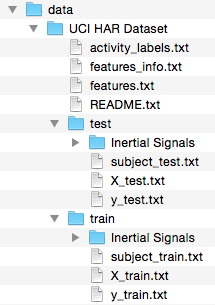

# "Getting and Cleaning Data" Course Project

This is a Course Project submission for the ["Getting and Cleaning Data" course](https://class.coursera.org/getdata-014) on [coursera](https://www.coursera.org).

The goal of the project is to perform cleanup on the UCI HAR Dataset, producing a tidy dataset that can be used for later analysis. The UCI HAR Dataset contains data collected from the accelerometers from the Samsung Galaxy S smartphone. A full description is available at the [UCI HAR website](http://archive.ics.uci.edu/ml/datasets/Human+Activity+Recognition+Using+Smartphones).

This project consists of the following items:

1. A script in R, [`download.R`](download.R), that will download the UCI HAR Dataset directly from the [UCI HAR website](http://archive.ics.uci.edu/ml/datasets/Human+Activity+Recognition+Using+Smartphones).
2. A script in R, [`run_analysis.R`](run_analysis.R), that will perform cleanup on the original raw data files from the UCI HAR Dataset, generating tidy datasets.
3. A [code book](CodeBook.md) describing the variables, the data, and all processing performed to clean up the data and obtain the tidy datasets.

## How to use this repository

Before you can use any of the tools in this repository you have to clone it from github:

```console
$ git clone https://github.com/sigriston/getdata-014-project.git
```

Also you have to make sure you have R installed. Check out the full official [R Installation Guide](http://cran.r-project.org/doc/manuals/r-release/R-admin.html) if you need to.

Next, you have to make sure you have R packages [`downloader`](https://github.com/wch/downloader) and [`dplyr`](https://github.com/hadley/dplyr) installed in your R. You can install them by using the following commands in your R or Rstudio console:

```r
install.packages("downloader")
install.packages("dplyr")
```

Last, but not least, all R source here has only been tested to run on R version 3.2.0. It is not guaranteed to run on much older versions of R, particularly due to the package dependencies.

## Downloading raw dataset

To download the raw dataset to your current working directory, simply source the [`download.R`](download.R) script in R or Rstudio:

```r
source("download.R")
```

Or, as an alternative, you can execute it from the command prompt / shell using the `Rscript` tool:

```console
$ Rscript download.R
```

The raw dataset will then be downloaded and unzipped into the `data` directory inside your current working directory. You don't have to create the `data` directory, it will be created for you if it doesn't exist.

## Generating tidy datasets

To generate the tidy datasets from the raw datasets, just use the `run_analysis.R` script much like the download script.

***WARNING!*** You can use the dataset that you downloaded yourself, just make sure you extract it inside a directory called `data` in your working directory. If you have a `data/UCI HAR Dataset` directory, you should be good to go, as it is illustrated in the following image:



To run the [`run_analysis.R`](run_analysis.R) script, you can just source it in your R or Rstudio console:

```r
source("run_analysis.R")
```

Or even execute it from the command prompt or shell with the `Rscript` tool:

```console
$ Rscript run_analysis.R
```

This script will then generate the tidy datasets and write them out as the following text files:

* `tidy_dataset_full.txt`: contains the full tidy dataset
* `tidy_dataset_summarized.txt`: contains the summarized tidy dataset

## Utilizing the tidy datasets

To fully utilize the tidy datasets generated in the previous step (`run_analysis.R`), please refer to the [**CODE BOOK**](CodeBook.md) included in this repository.

## License

MIT License. (c) 2015 Thiago Sigrist.

If you are taking the "Getting and Cleaning Data" course on coursera, please refrain from copying anything from here. Please develop your own solution, then come back here after submitting it. :-)
